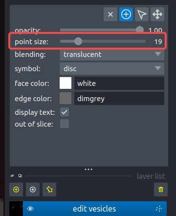

# 1. Data Preprocessing

Data preprocessing is a critical step in the workflow and sets the foundation for successful vesicle segmentation. This phase consists of several key operations, detailed below:

## 1.1. File Organization

Proper file organization is crucial for streamlined processing. All files to be analyzed must be organized into subfolders within a main directory. Each subfolder (e.g., `p545`, `p565`, `pp1134`) should contain the respective `.mrc` or `.rec` files. These files are the raw tomography images that will undergo segmentation. Additionally, the main folder must include a `segVesicle.batch` file, which lists the images to be processed.

The `segVesicle.batch` file serves as an index for segmentation and must be present before running the workflow. If this file does not exist, you can easily generate it either via the command line or through the GUI.

**Generating segVesicle.batch via Command Line:**

You can use the following command to automatically create a `segVesicle.batch` file by listing all subfolders containing the desired files:

```bash
ls */*-bin4-wbp.rec > segVesicle.batch
```

**Creating segVesicle.batch via GUI:**

Alternatively, you can create the file using the "Create segVesicle.batch" button located in the top right corner of the SegVesicle interface.


**Recommended File Structure:**

For better file management and ease of access, we recommend organizing your files as depicted below:

```
any_folder/
├── p545/
│   ├── p545*.mrc
│   ├── p545*.rec
│   └── ...
├── p565/
│   ├── p565*.mrc
│   ├── p565*.rec
│   └── ...
├── pp1134/
│   ├── p565*.mrc
│   ├── p565*.rec
│   └── ...
├── ...
└── segVesicle.batch
```

Additionally, each tomo file can be displayed on the right side with options to mark it using a checklist and a heart icon. The heart icon can be toggled to indicate favorites, while the checklist tracks the processing status. Double-clicking a file will automatically open the image and load it into the corresponding stage of SegVesicle.


## 1.2 Opening the Original Tomography Image

The "Open Original Tomo" button in the interface now includes the `resample` function, which automatically standardizes the voxel size across all images, ensuring consistency when working with data from different sources or resolutions. This integration simplifies the workflow by handling resampling directly upon loading the original tomography image.

**How It Works:**

1. Click the "Open Original Tomo" button in the interface.
2. A dialog will prompt you to manually enter the original pixel size of the image.
3. After confirming the pixel size, the image will be automatically resampled to the standardized voxel size, streamlining the preprocessing steps.

**Example Command-Line Resampling (if needed separately):**

For situations where you need to resample manually via the command line, you can use the following command:

```bash
resample.py --tomo=input_tomo.mrc --pixel_size=17.14 --outname=output_resample.mrc
```

## 1.3. Deconvolution

Deconvolution is an advanced image processing technique applied to reduce blurring and improve resolution in tomography images. In `SegVesicle`, deconvolution is a key step to enhance image quality, allowing for better identification and segmentation of small structures like vesicles.

### Process Overview

**Selecting the Deconvolution Area:**

- **Defining the Preview Area:**  
  To perform deconvolution, begin by selecting two points within the tomography image. These points will define a rectangular area that serves as the preview region. The preview allows you to test various deconvolution settings and observe their effects before applying them to the entire image.

**Role of SNR (Signal-to-Noise Ratio):**

- **Adjusting SNR for Optimal Results:**  
  The Signal-to-Noise Ratio (SNR) is a critical parameter that influences the quality of the deconvolved image. In the `SegVesicle` interface, you can adjust the SNR during the preview phase to balance noise reduction and signal clarity.

  - **Lower SNR Values:**  
    Lower values may result in less noise reduction, yielding a clearer image but potentially with less sharpness.
  
  - **Higher SNR Values:**  
    Higher values can highlight finer details but may also amplify noise, making it crucial to find the right setting.

**Applying Deconvolution:**

Once satisfied with the preview, click the **Apply** button to apply deconvolution to the entire image using the chosen SNR settings. Upon completion, the deconvolved image will be automatically saved, ensuring that your processed data is readily available for further steps.


## 1.4. IsoNet Correction

IsoNet correction addresses the missing-wedge effect commonly found in electron tomography, significantly improving the resolution and interpretability of 3D images. IsoNet correction is typically applied after deconvolution, further refining the image and making it more suitable for downstream analysis, such as vesicle segmentation.

**Prerequisite:**

IsoNet correction requires the installation of `tensorflow-gpu` to leverage GPU acceleration for faster processing. Ensure that your environment is properly configured with the necessary GPU drivers and that `tensorflow-gpu` is installed. 

---

# 2. Inference and Post Processing

The Inference and Post Processing phase leverages a trained model to predict vesicle locations within tomography images. It includes automated segmentation, morphological processing, and visualization of the results.

**1. Loading Image Data:**

This phase begins with loading the deconvolved (`deconv_tomo`) and corrected (`corrected_tomo`) tomography data into the SegVesicle viewer. These layers are the inputs for vesicle prediction.

**2. Defining the Synaptic Area (`area.mod`):**

Before predicting vesicles, it’s important to define the synaptic area. This is done by manually drawing the region of interest (ROI) within the tomography. Follow these steps:

- **Drawing the Synaptic Region:**
  - Select the middle frame of the region of interest and use points to encircle the synapse area in order.
  - Next, move the Z-axis to the top and bottom of the synaptic area and select two points that define the boundaries.
- **Drawing the Tomographic Area:**
  - Once the area is defined, click the **Draw Tomo Area** button to generate the `area.mod` file.

This step is crucial for accurately identifying vesicles within the synaptic region.

**3. Predicting Vesicles:**

- **Vesicle Prediction:**
  After defining the synaptic area, click the **Predict** button to run the trained model on the loaded images. The model generates a label image where each voxel is classified as either vesicle or non-vesicle.

- **Post Processing:**

- **Morphological Processing:**
  The label image is further refined using the `morph_process` function, which uses the area file to improve vesicle shape and accuracy.

- **Vesicle Measurement:**
  The processed vesicle labels are analyzed by the `vesicle_measure` function, which measures key attributes such as size and shape, storing them in a structured format.

- **Ellipsoid Fitting and Fit Using Density:**
  For visualizing the segmented vesicles we use: **Ellipsoid Fitting** for geometrically fitting ellipsoids, and **Fit Using Density** for rendering based on the vesicle's density profile. The rendered vesicles are saved and displayed in the viewer.

## 4. **Manual Annotation:**
  If you prefer to manually annotate vesicles without model, click the **Manually Annotation Only** button to disable automatic prediction and allow full manual control over vesicle labeling.


---

# 3. Manually Revise Annotation and Retrain Model

The manual revision and retraining phase allows you to correct any inaccuracies in the vesicle segmentation and subsequently improve model performance through retraining.

## 3.1. Revising Vesicle Annotations

All editing operations are performed in the "edit vesicles" layer. The following tools are available for revising annotations:

- **Delete Incorrect Vesicles:**  
  To remove a misidentified vesicle, left-click a point inside the vesicle and press the shortcut key `D`.

- **Add Missing Vesicles Using 3D Density Fitting:**  
  For vesicles that were not detected, identify the largest cross-section of the vesicle. Left-click both the center of the vesicle and its membrane, then press `G` to fit the vesicle using 3D density information.

- **Add Missing Vesicles Using 2D Density Fitting:**  
  For cases where 2D fitting is sufficient, left-click both the center and the membrane of the missing vesicle in its largest cross-section, then press `F` to fit the vesicle using 2D density.

- **Add Missing Vesicles Using 2D Manual Fitting:**  
  If more control is needed, manually annotate the vesicle by left-clicking six points along its membrane in the largest cross-section, then press `h` to perform a 2D manual fit.

These steps allow precise control over the vesicle annotations, ensuring the data reflects the actual structures.

## 3.2. Retraining the Model

After completing manual revisions, the model can be updated to incorporate these corrections:

- **Model Update:**  
  Add the corrected annotations and any additional data to the training set.

- **Retraining:**  
  Re-train the model with the updated dataset to enhance its accuracy and improve segmentation performance in future analyses.

---

# 4 Results Analysis

After segmentation, detailed analysis is performed to evaluate and visualize the results:

- **Result Visualization:** Expert analysis of the segmentation output.
- **Performance Evaluation:** Quantitative metrics like accuracy, recall, and F1 score are computed to assess the model’s performance.

---

# Frequently Asked Questions

1. **Why do shortcut keys sometimes fail to register?**  
   This issue can usually be resolved by clicking on a few blank spots and rapidly pressing the small trash icon. While the exact cause is unknown, this workaround often helps restore functionality.
2. **Q: How can I adjust the size of points in the 'edit vesicle' layer when drawing the area mod or modifying labels?**
    A: When working in the 'edit vesicle' layer, you may want to change the size of the points to better fit your needs. You can adjust the point size by using the mouse scroll wheel or by dragging the slider located in the top left corner of the interface. This allows for precise control when drawing the `area.mod` or adding/removing labels.
    
    


---

### 5. References

- [1] [Isotropic Reconstruction For Electron Tomography](https://isonetcryoet.com/)
- [2] Additional reference here.

---

For any questions or technical support, please reach out to our support team.