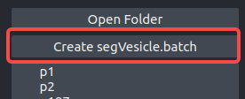
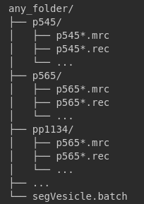
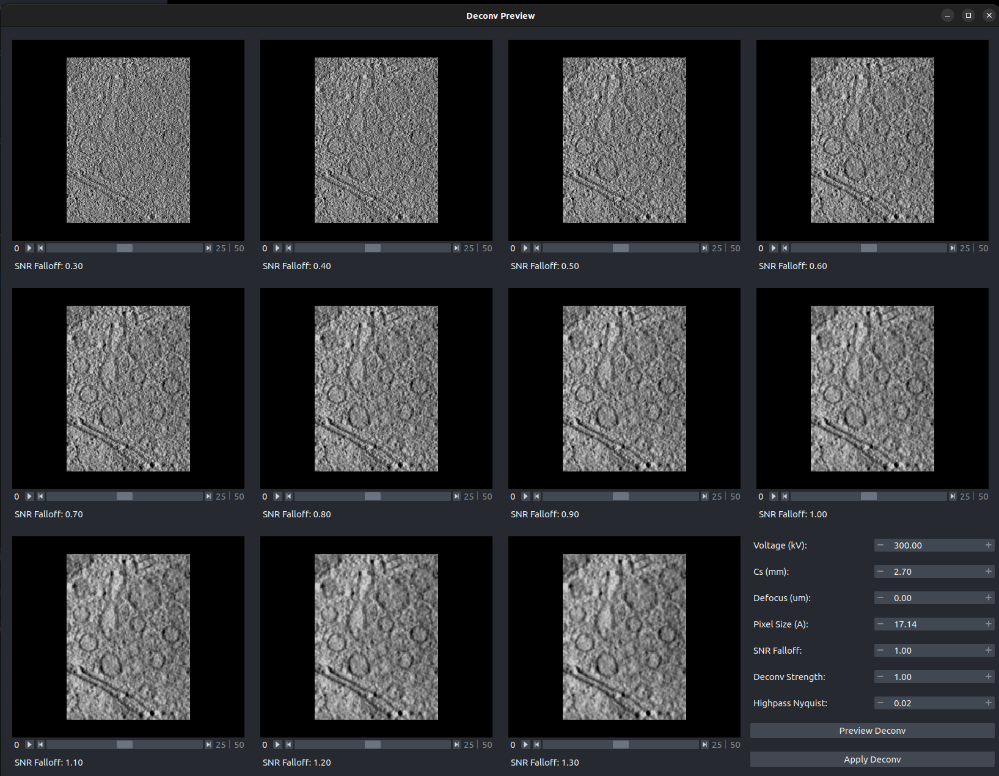

# SegVesicle User Guide

## Table of Contents
1. [Overall Workflow](#1-overall-workflow)
2. [Component Overview](#2-component-overview)
   - [Data Preprocessing](#21-data-preprocessing)
   - [Inference and Post Processing](#22-inference-and-post-processing)
   - [Manual Annotation](#23-manual-annotation)
   - [Retrain and Results Analysis](#24-retrain-and-results-analysis)
3. [Frequently Asked Questions](#3-frequently-asked-questions)
4. [References](#4-references)


## 1. Overall Workflow
The workflow of `SegVesicle` is structured into the following steps:

1. **Data Preprocessing**: Organize all the files to be processed in a single folder. Apply deconvolution and correction using IsoNet[1] for image enhancement.
2. **Inference and Post Processing**: Utilize the trained model to make predictions on new images.
3. **Manual Annotation**: Manually correct the model’s predictions as needed.
4. **Retrain and Results Analysis**: Retrain the model based on manual corrections to enhance its accuracy, followed by an analysis of the segmentation results.

## 2. Component Overview

### 2.1 Data Preprocessing

Data preprocessing is the initial phase in the workflow and includes the following steps:

#### File Organization
All files to be processed should be organized into subfolders within a main folder. Each subfolder (e.g., `p545`, `p565`, `pp1134`) must contain the respective `.mrc` or `.rec` files. Additionally, the main folder should include a `segVesicle.batch` file that contains information about the images to be segmented.

If the `segVesicle.batch` file is not present, you can create it using the command line with the following command:

`ls */*-bin4-wbp.rec > segVesicle.batch`

Alternatively, you can create the file using the "Create segVesicle.batch" button located in the top right corner of the SegVesicle interface.



The recommended file organization structure is depicted below:



#### Resample

The `resample` function is used to adjust the voxel size of the original tomography image. This step is crucial when working with images of varying resolutions, ensuring that all data is standardized to the desired voxel size for consistent analysis.

**Opening Original Tomography Image:**

You can open the original tomography image by clicking the "Open Original Tomo" button in the interface. After opening the image, you will be prompted to manually enter the original pixel size of the image. Alternatively, you can run the resampling process via the command line as described below.

**Example Command-Line Usage:**

To resample a tomography image with a pixel size of 10.0 and save it as `output_resample.mrc`:

```
python resample.py --tomo=input_tomo.mrc --pixel_size=10.0 --outname=output_resample.mrc
```
#### Deconvolution

The deconvolution process in `SegVesicle` is an essential step to enhance the quality of tomography images by reducing blur and improving the resolution. This step is particularly important for identifying small structures such as vesicles with greater accuracy.

##### Process Overview

**Selecting the Deconvolution Area:**

- **Defining the Preview Area:**  
  To start the deconvolution process, you need to select two points on the screen within the tomography image. These two points will form a rectangle that defines the area for deconvolution. This region is crucial as it allows you to preview the effect of different deconvolution settings before applying them to the entire image.

**Role of SNR (Signal-to-Noise Ratio):**

- **Adjusting SNR for Optimal Results:**  
  The Signal-to-Noise Ratio (SNR) is a key parameter in the deconvolution process. Adjusting the SNR value can significantly affect the clarity and quality of the resulting image. In `SegVesicle`, you can fine-tune the SNR value during the preview phase to achieve the best balance between noise reduction and signal preservation.

  - **Low SNR Values:**  
    Lower SNR values might result in less noise reduction, leading to a clearer but possibly less sharp image.
  
  - **High SNR Values:**  
    Higher SNR values tend to emphasize signal details but may also amplify noise, making it essential to find the right balance.

**Applying Deconvolution:**



- **Preview and Apply:**  
  Once you have selected the appropriate SNR value by previewing the deconvolution effect within the defined area, you can click the **Apply** button. This will apply the deconvolution to the entire image based on the selected SNR settings.

This approach allows you to visually assess the impact of deconvolution on a specific area before committing to changes across the entire image, ensuring optimal image quality.

#### IsoNet Correction

IsoNet correction is a step in the `SegVesicle` workflow that correcting the missing-wedge effect and improving the overall resolution and interpretability of the 3D tomographic images. This step is typically performed after deconvolution to refine the image further, making it more suitable for detailed analysis and segmentation.

### 2.2 Inference and Post Processing

The Inference and Post Processing phase in `SegVesicle` involves using the trained model to predict vesicle locations in the tomography images and subsequently processing these predictions to refine and analyze the results. This step is crucial for automatically identifying vesicles and preparing the data for further analysis.

#### Process Overview

**1. Loading Image Data:**

  The function loads the deconvolved (`deconv_tomo`) and corrected (`corrected_tomo`) tomography data from the viewer's layers. These images serve as the input for the vesicle prediction model.

**2. Predicting Vesicles:**

- **Vesicle Prediction:**
  The `predict_label` function is used to generate predictions based on the deconvolved and corrected tomography data. This function processes the input data to identify regions that likely contain vesicles, producing a label image where each voxel is assigned a label indicating whether it is part of a vesicle or not.

**3. Post Processing:**

- **Morphological Processing:**
  The predicted label image is then passed to the `morph_process` function along with the path to the area file (`area_path`). This function performs morphological processing to refine the predicted vesicle shapes and prepare them for measurement and rendering.

- **Vesicle Measurement:**
  The `vesicle_measure` function analyzes the processed vesicle labels in the context of the corrected tomography data. It measures key attributes of each vesicle, such as size and shape, and stores this information in a structured format. The minimum radius for vesicles is set to `8`.

- **Vesicle Rendering:**
  The `vesicle_rendering` function generates a visualization of the identified vesicles based on the measured data. This rendered image is saved as a new tomography file, and the corresponding labels are added to the viewer.


### 2.3 Retrain Model
Retraining the model includes:
- **Model Update**: Incorporate the manual corrections into the training dataset.
- **Retraining**: Retrain the model with the updated dataset to improve its accuracy and performance.

### 2.4 Results Analysis
Results analysis includes:
- **Result Visualization**: Visualize the segmentation results for expert analysis and evaluation.
- **Performance Evaluation**: Evaluate the model performance using metrics such as accuracy, recall, F1 score, etc.

## 3. Frequently Asked Questions
1. **Sometimes shortcut keys fail to register. How to resolve this?**
   - Select a few blank spots and rapidly click the small trash icon multiple times. This usually helps in successfully registering the shortcut keys, although the exact reason is unknown.


## 5. References
- [1] [Isotropic Reconstruction For Electron Tomography](https://isonetcryoet.com/)
- [2] Reference B

---

If you have any questions or need further assistance, please contact the technical support team.
